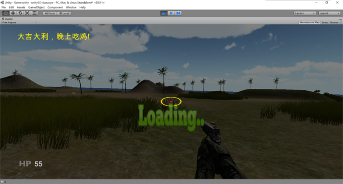

# 迷你PUBG射击游戏

## 游戏介绍

- 该项目为一款射击游戏，该游戏包含两个场景，玩家可通过搜寻武器对人机进行射击，杀掉所有敌人则为游戏胜利，玩家血量初始为100，被敌人射击则扣血，血量值为0则游戏失败。
- 游戏的输入控制：键盘WASD控制玩家方向移动，鼠标控制镜头，单击鼠标左键射击，数字键1,2切换武器。
- 开发环境：vs2017、unity4.6

## 主要功能

1. 本款游戏为单机游戏，总共分为两个场景，首先是开始场景，开始场景中主要有游戏背景，游戏开始的按钮，以及logo动画和载入游戏的贴图。
   - 开始场景
   
     
   
2. 当玩家点击开始游戏之后会进入到游戏场景，在游戏场景中有玩家、车子、房屋、AI、手枪以及玩家的血量显示。在刚进入游戏场景时，玩家是没有手枪的，我们可以通过控制玩家的移动、是否驾驶载具来寻找玩家需要的武器，当玩家找到武器之后便可以将其拾取作为自己的武器，**游戏中可以按F键驾驶跑车，按G键离开跑车**，当我们捡到手枪，我们就可以将房屋外面巡逻的人机杀掉，与人机对打的过程中，玩家也会受到伤害，当玩家的血量为0的时候，我们会输掉这场游戏，当我们杀掉所有的人机的时候，我们会赢得这场游戏。

   - 进入游戏

     

   - 驾驶载具
   
     
   
   - 在游戏中，房屋有一个停车库，玩家可以把车开到停车库中，当玩家靠近停车的时候，车库的们会自动拉起，开进去之后，车库的门会自动关闭。
   
     
   
   - 玩家将车开进车库，已然可以看见地上的手枪和在巡逻的人机，玩家可以将车开进车库，按G下车，将手枪拾起，开门出去与人机决战。
   
     
     
   - 在玩家被打中的时候玩家的血量会减少，玩家打人机，人机的血量也会减少，当血量为0的时候人机会倒地死亡。当杀掉所有人机的时候，游戏会弹出“大吉大利，晚上吃鸡”的字样，出现该提示即证明玩家胜利。
     
     
     
## 技术重点

1. 地形的绘制，使用羽化功能可将层次不齐的地形过渡柔化，使得地形看起来光滑。
2. 3d模型的导入，网格碰撞器的添加。
3. Gui的制作，文字的显示与动态更改，动画的制作。
4. 玩家与跑车之间的交互，摄像机深度的设置，以及声源监听的确定。（一个游戏只允许有一个声源监听器）
5. 捡手枪的效果实现，这里需要实时的刷新，否则拾取到的手枪不会显示，而要通过武器切换的按键来将拾取到的武器呼出来。
6. AI的添加，有线状态机的创建。